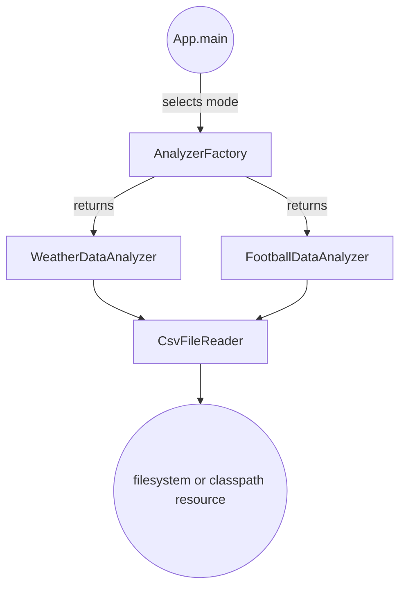

# Solution Architecture

This section explains the design decisions, components, and how the solution meets the goals of robustness, correctness, readability, maintainability, and clean architecture.

## Components

1. **App (Entry Point)**
   - Parses CLI flags: `--weather` or `--football`
   - Chooses default paths if no file is provided
   - Delegates to a `DataAnalyzer` implementation
   - Handles errors centrally with exit codes

2. **DataAnalyzer (Interface)**
   - Defines a single method `findMinSpread(String filePath)`
   - Enables plugging in new analyses (e.g. JSON, web services)

3. **CsvFileReader**
   - Opens CSV from file system or classpath
   - Parses header line, normalizes to lowercase keys
   - Provides two methods:
     - `read(String)` → raw `String[]` list
     - `readAsMap(String)` → `Map<header,value>` list
   - Centralized handling of I/O exceptions for robustness

4. **WeatherDataAnalyzer & FootballDataAnalyzer**
   - Implement `DataAnalyzer`
   - Use `readAsMap(...)` for dynamic header lookup
   - Validate presence of required fields (throw NPE if missing)
   - Parse numeric values (fail-fast on format errors)
   - Compute minimum spread and return identifier

5. **Test Suites**
   - **Unit Tests** use JUnit 5 and `@TempDir`
   - Cover:
     - Default resource-based invocation
     - Swapped header orders
     - Missing columns (NullPointerException)
     - Empty files (`null` result)
     - Invalid numeric formats (`NumberFormatException`)

## Design Rationale

- **Robustness & Correctness**  
  - Dynamic header mapping prevents index-based fragility.  
  - Explicit column validation surfaces missing data early.  
  - Fail-fast on parse errors ensures no silent corruption.

- **Readability & Maintainability**  
  - Clear package structure (`csv`, `analysis`, root)  
  - Minimal dependencies, concise classes  
  - Well-named classes and methods reflect intent  
  - Centralized CSV handling prevents duplication

- **Clean Software Design & Architecture**  
  - Interface-driven design (`DataAnalyzer`) for extension  
  - Separation of concerns: I/O, parsing, analysis, orchestration  
  - Single-responsibility principle applied to each class  
  - Expandable to new formats (JSON, XML, web API) by implementing `DataAnalyzer` and a corresponding Reader

---

This documentation, together with the modular code and extensive tests, demonstrates a professional, sustainable approach suitable for production and team collaboration.
